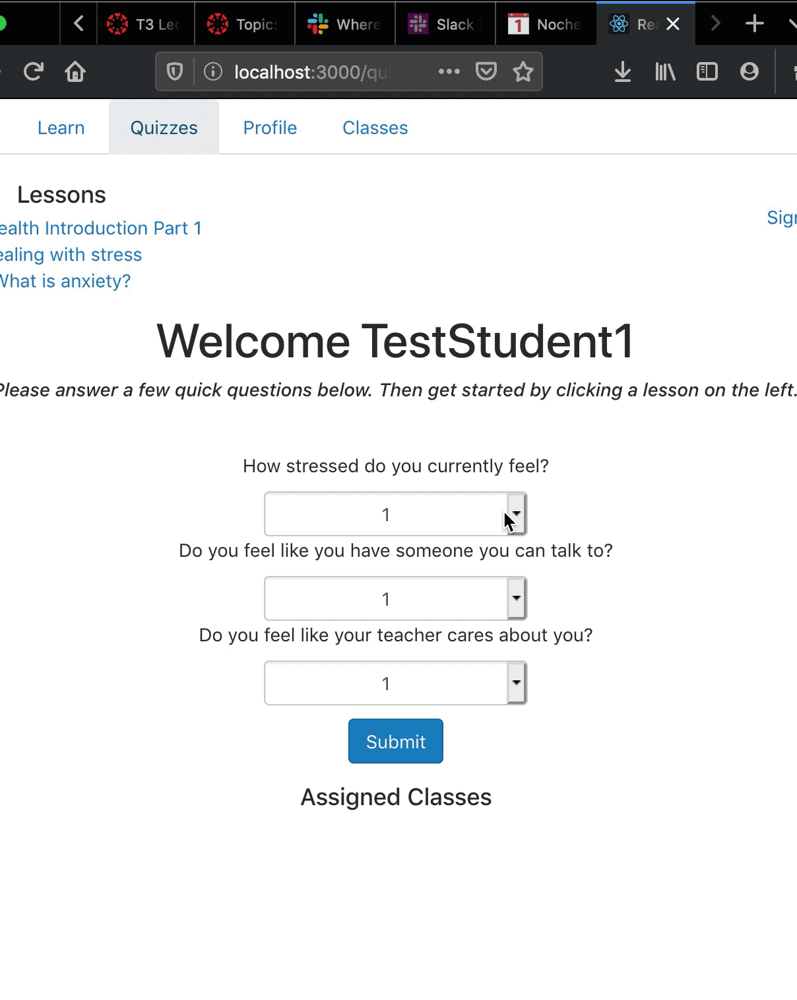
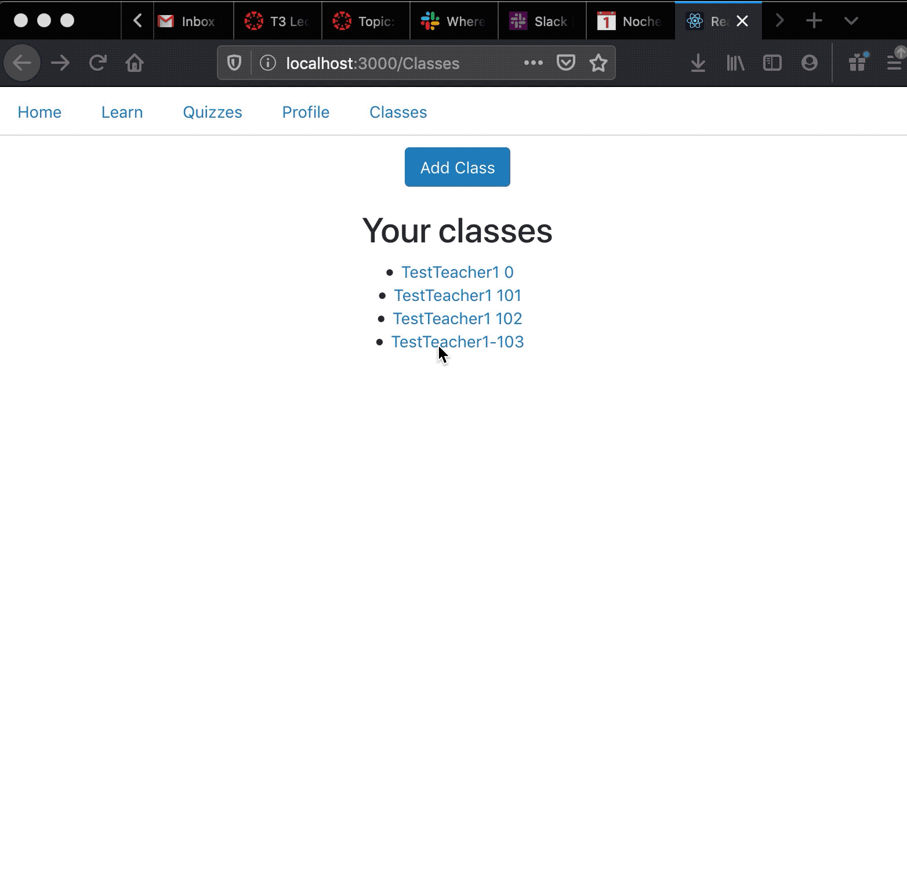
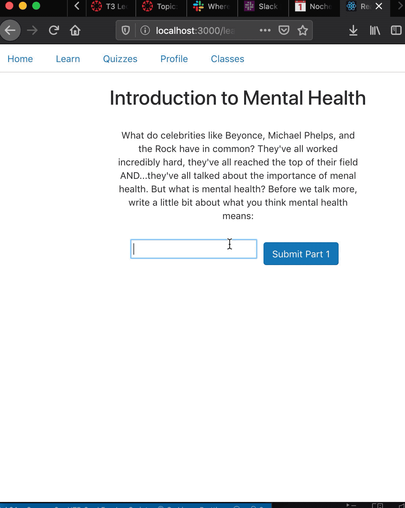

# OpenMind is a software program designed to revolutionize mental health education

Please keep in mind these are images from a very early prototype
 
 
 

In the following gif, you can see a student taking a quick, lightweight quiz to assess their current emotional state. The questions on these quizzes are science-backed and proven to be a reliable indicator of current mental health state. Yet the quiz is also lightweight enough that it does not feel intimidating or overly time consuming for students. 
 
 

 
 

In this gif, you will see the teacher data page. Based on data gathered from students, the teacher data page will both inform teachers of how their students are feeling, signal out any students who might require extra attention, and recommend educational modules that would benefit the class. 

 
 
 

 
 

In this gif, you can see a very rough skeleton of what a module looks like. This text is not anywhere close to final, nor are the images. But you can get a sense of the fact that the modules would be interactive. The celebrity names in the beginning are based on student interests. 

 
 
 

